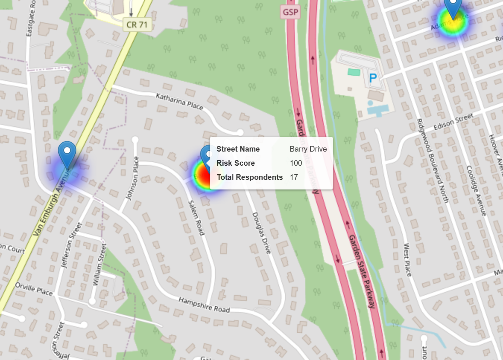

# Flood Risk Heatmap for Washington Township

This project visualizes flood-prone areas and calculates flood risk based on data collected from the residents of Washington Township. The heatmap displays normalized risk scores for various streets, offering an intuitive representation of potential flood hazards.

## Project Overview

Flood risk for each street was calculated using the formula:


The risk values were normalized based on survey responses from residents across different streets. The resulting heatmap provides a clear visualization of flood-prone areas and varying risk levels.

### Features

- **Interactive Heatmap**: Displays flood risk levels for different streets using color intensity to indicate severity.
- **Search Functionality**: Quickly locate specific streets using the built-in search bar.
- **Tooltips**: Hover over map points to view detailed street-specific information, including:
  - Street Name
  - Risk Score
  - Total Respondents
- **Full-Screen Support**: Expand the map for an enhanced viewing experience.
- **Normalized Data**: All risk values are adjusted based on population responses for fair comparisons.

## Technology Stack

- **Python**: Used for data preprocessing and generating the interactive map with the `folium` library.
- **Folium**: A Python library for creating interactive maps using Leaflet.js.
- **HTML & JavaScript**: Enables dynamic and interactive map rendering in web browsers.
- **Leaflet Plugins**:
  - `Leaflet.heat` for generating the heatmap layer.
  - `Leaflet.Search` for adding search functionality.
  - `Leaflet.Fullscreen` for full-screen viewing.

## How to Use

1. Clone the repository to your local machine:
   ```bash
   git clone https://github.com/your-username/flood-risk-heatmap.git
2. Navigate to the project folder:
   ```bash
   cd flood-risk-heatmap
3. open heatmap.html

## Interacting with the Map

- **Explore**: Pan and zoom to navigate the township.
- **Search**: Use the search bar to find a specific street by name.
- **Details**: Hover over points to display a tooltip with detailed flood risk data for that street.

## Data Visualized

- **Street Name**: Name of the street surveyed.
- **Normalized Risk Factor**: A normalized score representing the flood risk.
- **Total Respondents**: Number of residents who contributed data for that street.

## Data Sources

The data used in this project was collected through a community survey conducted using Qualtrics. Residents of Washington Township reported:

- Likelihood of flooding in their area.
- Estimated damage costs in case of flooding.

This information was compiled, processed, and normalized to create a comprehensive flood risk map.

## Screenshots

- **Heatmap Overview**: 
- **Tooltip Example**: 

## License

This project is licensed under the [MIT License](LICENSE).

## Acknowledgements

- **Folium Library**: For simplifying the creation of interactive maps.
- **Leaflet.js**: The JavaScript library powering the interactive map rendering.
- **Washington Township Residents**: For providing the data that made this project possible.


